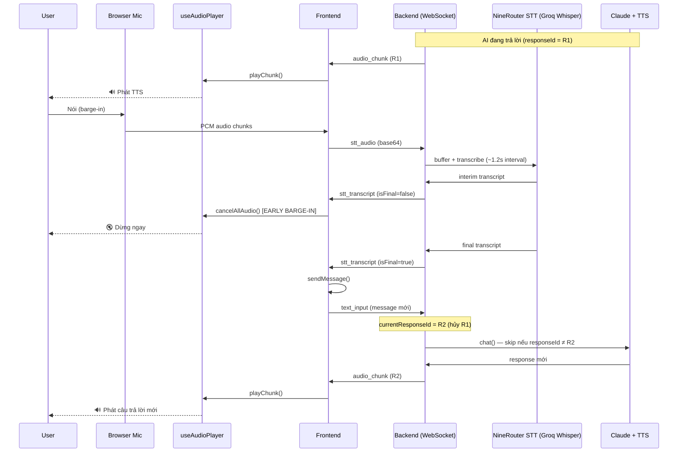
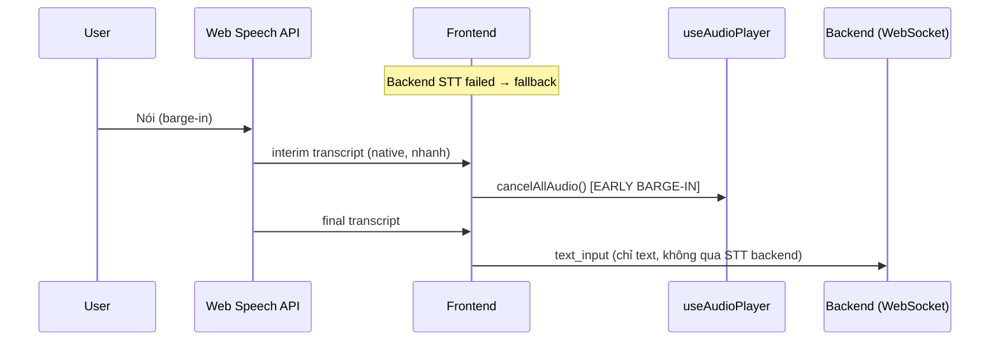

# Barge-in (Cut-in / 割り込み) — Tài liệu tính năng

> **Barge-in** (còn gọi là *cut-in*, *voice interrupt*, hoặc tiếng Nhật *バージイン*) cho phép người dùng **ngắt lời AI đang nói** và đặt câu hỏi mới ngay lập tức — giống cách nói chuyện tự nhiên với con người.

---

## 1. Tổng quan

Trong hệ thống Rabbit AI Avatar, barge-in hoạt động theo mô hình **full-duplex giả lập**:

| Thành phần | Vai trò trong barge-in |
|------------|------------------------|
| **STT layer** (xem §1.1) | Phát hiện giọng nói người dùng (interim + final transcript) |
| **useAudioPlayer** (frontend) | Dừng TTS đang phát, xóa queue audio, từ chối audio cũ |
| **useWaitingPhrase** (frontend) | Dừng âm thanh chờ (short waiting) khi user ngắt lời |
| **WebSocket handler** (backend) | Hủy response cũ qua `responseId`, bỏ qua TTS chunk đang stream |

### 1.1 STT thực tế — KHÔNG phải Google STT ⚠️

Hook frontend tên `useGoogleSTT` là **tên legacy/sai** — codebase **không dùng Google Cloud STT** trong luồng chính.

| Mode | Khi nào active | Cách hoạt động |
|------|----------------|----------------|
| **Primary: NineRouter STT** | Backend STT khởi động thành công | Mic → WebSocket `stt_audio` → Backend buffer PCM → Groq Whisper (qua 9Router hoặc trực tiếp) → `stt_transcript` |
| **Fallback: Web Speech API** | Backend trả `stt_error` (thiếu credential, API key sai…) | Browser native `webkitSpeechRecognition` — **không qua backend** |

```
┌─────────────────────────────────────────────────────────────┐
│  Frontend (useGoogleSTT — tên hook, không phải Google STT)  │
│                                                             │
│  [Primary]  Mic → stt_start/stt_audio → Backend             │
│                    ↓                                        │
│             NineRouter STT (Groq Whisper)                   │
│                    ↓                                        │
│             stt_transcript (interim/final)                  │
│                                                             │
│  [Fallback] stt_error (credential) → Web Speech API         │
│             Browser native, interim ngay lập tức            │
└─────────────────────────────────────────────────────────────┘
```

**Cách kiểm tra mode đang chạy** (browser console):

| Log | Mode |
|-----|------|
| `✅ Google STT started successfully` + backend `9Router STT session started` | Primary (NineRouter) |
| `Backend STT unavailable (...) — falling back to Web Speech API` | Fallback (Browser native) |
| `🎤 Web Speech Recognition started` | Fallback đang active |

> `backend/src/services/google-stt.ts` tồn tại nhưng **không được wire** vào WebSocket handler — là dead code.

**Trải nghiệm người dùng:**

1. AI đang trả lời bằng giọng nói (status: `speaking`)
2. Người dùng bật mic và nói (mic **không cần tắt** — luôn bật trong cuộc hội thoại liên tục)
3. Hệ thống **dừng audio ngay lập tức** (early barge-in ~300–500ms nhanh hơn)
4. Transcript được gửi lên backend → tạo response mới

UI gợi ý: placeholder `"Speaking... (talk to interrupt)"` khi AI đang nói.

---

## 2. Luồng hoạt động

### 2.1 Sơ đồ tổng thể

#### Path A — Primary: NineRouter STT (backend)



#### Path B — Fallback: Web Speech API (browser native)

Kích hoạt khi backend STT lỗi credential (`stt_error`). **Không stream audio lên backend** — nhận diện hoàn toàn trên browser.



> **Khác biệt quan trọng cho barge-in:** Web Speech interim **nhanh hơn** (~100–300ms). NineRouter STT buffered có interval mặc định `NINEROUTER_STT_INTERVAL_MS=1200` → early barge-in **chậm hơn** trên path primary.

### 2.2 Hai giai đoạn phát hiện (Frontend)

| Giai đoạn | Trigger | Ngưỡng mặc định | Mục đích |
|-----------|---------|-----------------|----------|
| **Early Barge-in** | Interim transcript (chưa final) | `NEXT_PUBLIC_EARLY_BARGE_IN_MIN_CHARS=2` | Dừng audio **sớm nhất** (~300–500ms), không chờ STT final |
| **Regular Barge-in** | Final transcript | `NEXT_PUBLIC_BARGE_IN_MIN_CHARS=5` | Gửi message mới lên backend; bỏ qua transcript quá ngắn (noise) |

**Logic trong `page.tsx`:**

```typescript
// Early: dừng audio khi phát hiện ≥2 ký tự interim
if (!isFinal && trimmedText.length >= EARLY_BARGE_IN_MIN_CHARS) {
  if (audioPlayer.isPlaying || wsStatus === "speaking") {
    audioPlayer.cancelAllAudio();
    earlyBargeInTriggeredRef.current = true;
  }
}

// Final: gửi message nếu ≥5 ký tự
if (isFinal && trimmedText.length >= BARGE_IN_MIN_CHARS) {
  sendMessage(trimmedText);
}
```

### 2.3 Hủy response phía Backend

Mỗi request tạo `responseId` duy nhất (`${sessionId}-${timestamp}`). Khi user gửi message mới:

1. `session.currentResponseId` được ghi đè → response cũ bị **coi là cancelled**
2. Mọi callback streaming (LLM delta, TTS chunk, DB search) kiểm tra:
   ```typescript
   if (session.currentResponseId !== responseId) return; // skip
   ```
3. Trước khi gửi kết quả cuối, backend kiểm tra lại — nếu đã cancelled thì **không gửi** text/audio

---

## 3. Chi tiết kỹ thuật

### 3.1 `cancelAllAudio()` — Frontend

Hook `useAudioPlayer` thực hiện:

- Dừng `AudioBufferSourceNode` đang phát
- Xóa toàn bộ audio queue (chunked TTS)
- Xóa protected audio queue
- Đặt `acceptedResponseIdRef = "__CANCELLED__"` → **từ chối mọi audio** đến sau cho đến khi có `responseId` mới

### 3.2 `responseId` — Đồng bộ Frontend ↔ Backend

| Trạng thái | Hành vi |
|------------|---------|
| Audio có `responseId` khớp | Phát bình thường |
| Audio có `responseId` không khớp | Bỏ qua (response cũ) |
| `__CANCELLED__` + audio không có responseId | Bỏ qua |
| `__CANCELLED__` + chunk 0 có responseId mới | Chấp nhận response mới |

### 3.3 Waiting phrase & barge-in

- **Short waiting** (`/waiting-short/*.mp3`): phát khi backend phản hồi > 1s (chỉ với query movie/gourmet)
- Khi barge-in: `stopWaitingPhrase()` được gọi trong `sendMessage()` — dừng timer và audio chờ
- Short waiting được thiết kế **protected** (không bị ngắt giữa chừng trong flow bình thường), nhưng **bị ngắt khi user chủ động barge-in**

### 3.4 Mic luôn bật (Continuous conversation)

- Mic **không tự tắt** sau khi user nói xong
- User chỉ tắt mic khi click nút mic
- Cho phép barge-in liên tục mà không cần bật lại mic

---

## 4. Cấu hình

### 4.1 Barge-in (frontend)

Thêm vào `frontend/.env.local`:

```env
# Số ký tự tối thiểu để GỬI message (final transcript)
# Tránh gửi noise / ký tự đơn lẻ
NEXT_PUBLIC_BARGE_IN_MIN_CHARS=5

# Số ký tự tối thiểu để DỪNG audio sớm (interim transcript)
# Thấp hơn = phản hồi nhanh hơn, nhưng dễ false positive
NEXT_PUBLIC_EARLY_BARGE_IN_MIN_CHARS=2

# Fast VAD (duration-guard) + duck sâu — xem §7.1.C, mặc định trong env.example
NEXT_PUBLIC_VAD_CONFIRM_MS=200            # RMS liên tục vượt ngưỡng bao lâu mới coi là "đang nói"
NEXT_PUBLIC_VAD_RELEASE_MS=200            # RMS liên tục dưới ngưỡng bao lâu mới coi là "hết nói"
NEXT_PUBLIC_TTS_VAD_DUCK_VOLUME=0.08      # mức duck sâu khi VAD xác nhận có giọng nói
NEXT_PUBLIC_TTS_DUCK_VOLUME=0.25          # mức duck ambient khi mic đang listen (không cần VAD)

# VAD ngưỡng thích ứng theo noise floor — xem §7.1.C.v2
NEXT_PUBLIC_VAD_NOISE_FLOOR_ALPHA=0.05    # tốc độ EMA theo dõi noise floor
NEXT_PUBLIC_VAD_ADAPTIVE_MULTIPLIER=3.0   # ngưỡng nói = noise floor * hệ số này

# AEC — NLMS echo canceller thật — xem §7.1.A.v2
NEXT_PUBLIC_AEC_ENABLED=true
NEXT_PUBLIC_AEC_TAP_COUNT=512             # số tap filter (~10-15ms @ 48kHz)
NEXT_PUBLIC_AEC_STEP_SIZE=0.3             # tốc độ học NLMS (mu)
NEXT_PUBLIC_AEC_MAX_DELAY_MS=250          # phạm vi tìm delay loa→mic
```

### Bảng khuyến nghị theo ngôn ngữ

| Ngôn ngữ STT | `EARLY_BARGE_IN_MIN_CHARS` | `BARGE_IN_MIN_CHARS` | Ghi chú |
|--------------|---------------------------|---------------------|---------|
| Tiếng Nhật (ja-JP) | 2 | 5 | 2 ký tự hiragana ≈ 1 âm tiết |
| Tiếng Anh (en-US) | 3 | 8 | Tránh trigger bởi "ok", "hi" |
| Môi trường ồn | 3–4 | 8–10 | Giảm false positive |
| Demo / UX ưu tiên tốc độ | 1–2 | 3–4 | Chấp nhận nhiễu cao hơn |

> **Lưu ý:** Hiện tại `page.tsx` cấu hình STT là `en-US`. Nếu chuyển sang `ja-JP`, nên điều chỉnh ngưỡng tương ứng.

### 4.2 STT backend (NineRouter — primary path)

Trong `backend/.env`:

```env
# STT qua 9Router (Groq Whisper)
NINEROUTER_STT_MODEL=groq/whisper-large-v3-turbo
NINEROUTER_STT_INTERVAL_MS=1200   # Interval gửi buffer → ảnh hưởng tốc độ interim barge-in

# Hoặc bypass 9Router, gọi Groq trực tiếp
GROQ_API_KEY=gsk_...              # Phải bắt đầu bằng gsk_, không phải org_
```

Nếu thiếu/sai credential → frontend **tự động fallback** sang Web Speech API.

---

## 5. File liên quan

| File | Vai trò |
|------|---------|
| `frontend/src/app/page.tsx` | Early + regular barge-in, gọi `sendMessage()`; duck TTS nội suy theo `voiceActive` + `echoCouplingRef` (§A.v2) |
| `frontend/src/hooks/useAudioPlayer.ts` | `cancelAllAudio()`, quản lý responseId |
| `frontend/src/hooks/useWaitingPhrase.ts` | `stopWaitingPhrase()` khi barge-in |
| `frontend/src/hooks/useGoogleSTT.ts` | **Tên legacy** — orchestrate STT: backend stream + Web Speech (fallback **và** assist); ✅ VAD duration-guard + ngưỡng thích ứng (`onVoiceActivity`, §C.v2), ✅ `webSpeechModeRef`/`onFastSignal` (parallel assist), ✅ `onEchoCoupling` (§A.v2) |
| `frontend/src/hooks/useWebSpeechFallback.ts` | Browser native STT — dùng ở 2 mode (fallback authoritative / assist fast-signal), không có tín hiệu VAD/AEC (không truy cập raw audio) |
| `frontend/src/utils/audioUtils.ts` | `AudioCaptureManager` — AEC browser (`echoCancellation`) qua `getUserMedia`; ✅ subscribe reference bus, forward vào worklet qua `processorOptions`/`postMessage`, đọc `couplingStrength` |
| `frontend/public/audio-processor.worklet.js` | ✅ **`EchoCanceller`** — NLMS adaptive filter thật, delay search, ring buffer reference real-time (§A.v2); RMS/PCM gửi ra đã qua echo cancellation |
| `frontend/src/utils/audioUnlock.ts` | `duckSharedVolume()`/`restoreSharedVolume()`; ✅ `onPlaybackReference()` — publish PCM TTS làm reference signal cho AEC (§A.v2) |
| `frontend/src/components/ChatInput.tsx` | UI placeholder "talk to interrupt" |
| `backend/src/websocket/handler.ts` | `stt_start`/`stt_audio`, `currentResponseId`, hủy response cũ; ✅ `Session.currentAbortController` — abort thật LLM call khi barge-in |
| `backend/src/services/claude.ts` | `chat()` nhận `signal?: AbortSignal`, truyền xuống mọi lời gọi `invokeLLM`/`invokeLLMStream` |
| `backend/src/services/claude/provider.ts` | `invokeLLM`/`invokeLLMStream` — unified layer, thread `signal` cho cả Anthropic & Bedrock |
| `backend/src/services/claude/anthropic-provider.ts` | `anthropic.messages.create/.stream(..., { signal })` |
| `backend/src/services/claude/bedrock-provider.ts` | `bedrockClient.send(command, { abortSignal })` — `signal` bị strip khỏi body trước `JSON.stringify` |
| `backend/src/services/ninerouter/stt.ts` | NineRouter STT session (primary backend STT) |
| `backend/src/services/google-stt.ts` | ⚠️ Dead code — không được dùng |
| `shared/types/index.ts` | `responseId`, `isProtected` trong protocol |

---

## 6. Đánh giá

### 6.1 Ưu điểm ✅

| # | Ưu điểm | Chi tiết |
|---|---------|----------|
| 1 | **Phản hồi nhanh (Early barge-in)** | Dùng interim transcript để dừng audio trước khi STT final — cải thiện ~300–500ms so với chỉ dùng final |
| 2 | **Hủy end-to-end** | Frontend dừng audio + Backend hủy LLM/TTS streaming qua `responseId` — tránh "ghost audio" (audio cũ vẫn phát sau khi ngắt) |
| 3 | **Chống noise cơ bản** | Ngưỡng `BARGE_IN_MIN_CHARS` lọc transcript quá ngắn, giảm gửi nhầm lên backend |
| 4 | **Hội thoại liên tục** | Mic luôn bật — UX tự nhiên, không cần bật/tắt mic mỗi lượt |
| 5 | **Tích hợp waiting phrase** | Barge-in cũng dừng âm thanh chờ, tránh chồng chéo audio |
| 6 | **Chunked TTS an toàn** | Queue audio + responseId tracking xử lý parallel TTS streaming đúng cách |
| 7 | **Cấu hình linh hoạt** | Env vars cho phép tune theo môi trường (demo vs production) |

### 6.2 Nhược điểm ⚠️

| # | Nhược điểm | Mức độ | Chi tiết |
|---|------------|--------|----------|
| 1 | ~~Echo / self-barge-in~~ | ~~Cao~~ | ✅ **Đã giảm thiểu** — `getUserMedia` đã có `echoCancellation/noiseSuppression/autoGainControl: true` (`audioUtils.ts`), cộng fast VAD duck sâu (§7.1.C). Text-heuristic (`bargeInGuard.ts`) vẫn là lớp lọc cuối, chưa có AEC tuyến tính thật (AEC3-class) |
| 2 | **False positive early barge-in** | Trung bình | Ngưỡng 2 ký tự interim dễ kích hoạt bởi noise, tiếng thở, hoặc echo |
| 3 | ~~Không có backend abort cho LLM~~ | ~~Trung bình~~ | ✅ **Đã triển khai** — `session.currentAbortController.abort()` hủy thật request Anthropic/Bedrock đang chạy, xem §7.1.B |
| 4 | **Protected audio không nhất quán** | Thấp | Short waiting "protected" nhưng vẫn bị barge-in override; long_waiting backend có `isProtected: true` nhưng đang disabled |
| 5 | **Không phân biệt ý định ngắt** | Trung bình | Mọi speech đều trigger barge-in — không phân biệt "ừ", "wait" vs câu hỏi thực sự |
| 6 | ~~Ngưỡng theo ký tự, không theo thời gian~~ | ~~Thấp~~ | ✅ **Đã triển khai** — fast VAD duration-guard (`NEXT_PUBLIC_VAD_CONFIRM_MS`/`_RELEASE_MS`) trong `useGoogleSTT.ts`, xem §7.1.C. Quyết định hard-cancel vẫn dựa transcript, chỉ phần duck dùng VAD |
| 7 | **STT language mismatch tiềm ẩn** | Thấp | Config hiện tại `en-US` trong khi app hướng tới tiếng Nhật — ảnh hưởng độ chính xác barge-in |
| 8 | **Không có visual feedback riêng** | Thấp | Chỉ có placeholder text; không có indicator "đang ngắt lời AI" |
| 9 | **Race condition TTS in-flight** | Thấp | TTS chunk đã synthesize xong trước khi cancel vẫn tốn resource backend dù frontend reject |
| 10 | **Tên hook gây hiểu nhầm** | Thấp | `useGoogleSTT` không dùng Google STT — dễ nhầm khi đọc doc/code |
| 11 | **NineRouter STT buffered, không streaming thật** | Trung bình | Interim transcript mỗi ~1.2s → early barge-in **chậm hơn** Web Speech native (~100–300ms) |
| 12 | **Hai STT path khác hành vi** | Trung bình | Dev dùng fallback (Web Speech) vs prod dùng NineRouter → barge-in latency khác nhau, khó reproduce bug |

---

## 7. Đề xuất cải thiện

> 📊 Đối chiếu cách các hệ thống lớn (Google, Amazon, Apple, OpenAI Realtime, LiveKit, Vapi...) giải quyết từng vấn đề dưới đây — xem **§9 Nghiên cứu đối chiếu ngành**.

### 7.1 Ưu tiên cao 🔴

#### A. Acoustic Echo Cancellation (AEC) — ✅ Đã có sẵn (xác nhận 2026-08-13)

**Vấn đề:** Echo từ loa → mic → STT → false barge-in.

**Trạng thái:** `AudioCaptureManager.start()` (`frontend/src/utils/audioUtils.ts`) đã gọi `getUserMedia` với `echoCancellation: true`, `noiseSuppression: true`, `autoGainControl: true` (`DEFAULT_AUDIO_CONFIG`) — nhận định "chưa có AEC" ở bản doc trước đó là **sai/lỗi thời**, code đã có sẵn từ trước. Đây là AEC ở mức browser (WebRTC APM), tương đương cách OpenAI Realtime/LiveKit client-side dùng — chưa phải AEC3-class tuyến tính chuyên dụng như Siri/Alexa.

Ngoài ra, `page.tsx` đã duck TTS volume xuống `TTS_DUCK_VOLUME` (0.25) bất cứ khi nào mic đang listen VÀ AI đang nói — giảm baseline echo pickup trước cả khi biết user có nói hay không. §C bên dưới bổ sung thêm lớp duck sâu hơn khi VAD xác nhận có giọng nói thật.

**Còn thiếu (chưa triển khai):** AEC3-class tuyến tính thật (linear adaptive filter theo research §9.1) — không khả thi thuần browser mà không dùng WebRTC PeerConnection loopback; cooldown period sau khi TTS bắt đầu đã có sẵn ở `bargeInGuard.ts` (`BARGE_IN_COOLDOWN_MS`, mặc định 600ms) từ trước, không phải đề xuất mới.

##### A.v2 — NLMS echo canceller thật (2026-08-13, level-up theo yêu cầu)

**Vấn đề còn lại của v1:** AEC vẫn hoàn toàn là "hộp đen" của browser — không biết browser có thực sự cancel tốt audio phát qua Web Audio API (không qua `<audio>`/`<video>` element) hay không, và Web Speech fallback path không có AEC nào cả (Web Speech tự quản lý mic nội bộ, code không có quyền set constraint).

**Đã làm:** Một bộ triệt echo **NLMS (Normalized Least-Mean-Squares)** thật, chạy trong `audio-processor.worklet.js`, độc lập với cờ `echoCancellation` của browser:

- **Reference signal chính xác**: `audioUnlock.ts` publish thẳng PCM thô của audio TTS ngay khi `source.start(0)` được gọi (`onPlaybackReference` pub/sub). `AudioCaptureManager` subscribe, resample về sample rate của AudioContext capture (dùng lại `resampleAudio` có sẵn), forward vào worklet qua `postMessage`.
- **Đồng bộ 2 AudioContext độc lập** (playback context và capture context không chia sẻ đồng hồ): thời điểm publish, subscriber đọc `currentTime` của CHÍNH capture context (không phải playback context) — vì callback chạy đồng bộ ngay trong `source.start(0)`, "now" ở 2 context là cùng một khoảnh khắc thực. Worklet dùng timestamp này để nhỏ giọt ("ingest") từng phần reference vào ring buffer đúng theo tiến độ audio *thực sự đang phát*, không phải "đã được queue" — quan trọng vì 1 chunk TTS có thể dài vài giây nhưng phát trải dài theo thời gian thực.
- **Delay estimation**: cross-correlation thô (bước 3 sample) giữa mic gần nhất và reference trong cửa sổ tìm kiếm `NEXT_PUBLIC_AEC_MAX_DELAY_MS` (250ms), chạy lại ~2 lần/giây, có **hysteresis** (chỉ chấp nhận delay mới nếu lệch >5ms so với delay hiện tại) để tránh reset filter liên tục do nhiễu đo đạc.
- **NLMS filter** (`NEXT_PUBLIC_AEC_TAP_COUNT`=512 tap ≈10-15ms tại 48kHz, mô hình hóa đường truyền âm trực tiếp loa→mic — không phải reverb cả phòng): dự đoán echo từ reference đã align theo delay, trừ khỏi mic **trước khi** tính RMS và **trước khi** gửi PCM lên Whisper — cả VAD và STT đều hưởng lợi từ audio đã sạch hơn.
- **Silence gate**: có 1 bug thật đã tìm và fix trong quá trình build — chia `gain = mu*error/energy` khi `energy` (năng lượng reference) tiến về 0 (lúc AI ngừng nói giữa câu) làm gain nổ, phá hỏng weight ngay lúc đó. Fix bằng cách theo dõi `avgEnergy` (EMA) và **bỏ qua update** khi `energy < avgEnergy * 5%`.
- Kết quả `couplingStrength` (0..1, độ tin cậy correlation tại delay ước lượng) được báo lên `useGoogleSTT` → `page.tsx` qua `onEchoCoupling`, dùng để **nội suy mức duck động** thay 2 mức cố định — coupling mạnh (loa+mic cùng máy) → duck sâu như cũ; coupling ~0 (headphone, không có đường echo vật lý) → gần như không duck, giữ độ tự nhiên/nhanh nhạy.

**Đã verify bằng simulation (Node, không phải browser thật)**: mock `AudioWorkletGlobalScope`, tạo tín hiệu tham chiếu dạng "giống giọng nói" (noise đã lọc + envelope chậm) + echo có delay/gain biết trước, chạy qua toàn bộ pipeline ingest→delay-search→NLMS. Kết quả: delay ước lượng đúng ±0ms ở 15/60/100/200ms test, ERLE (Echo Return Loss Enhancement) ổn định ~3.5-3.9dB sau hội tụ (giảm ~55-60% năng lượng echo), không NaN/instability qua nhiều lần chạy.

**Hạn chế đã biết:**
- Đây là filter **direct-path ngắn** (~10-15ms), không phải AEC3-class full room-reverb canceller (AEC3 dùng partitioned FFT block, filter 100-300ms) — đủ cho coupling trực tiếp loa↔mic laptop/phone, không cancel được phản xạ phòng phức tạp.
- ERLE ~3.5-4dB là mức khiêm tốn (chưa test với audio giọng nói thật, chỉ synthetic) — cần test thật với mic+loa để biết hiệu quả thực tế; có thể cần tinh chỉnh `NEXT_PUBLIC_AEC_STEP_SIZE`/`NEXT_PUBLIC_AEC_TAP_COUNT` theo thiết bị thật.
- Vẫn không có trên path Web Speech fallback (không truy cập raw audio).
- Chưa test trên thiết bị di động (CPU yếu hơn) — 512 tap × ~48000 sample/s × 2 loop (predict+update) có thể cần giảm tap count trên máy yếu; đã để config qua env để dễ chỉnh (`NEXT_PUBLIC_AEC_ENABLED=false` để tắt hoàn toàn nếu gây vấn đề).

#### B. AbortController cho LLM streaming — ✅ Đã triển khai (2026-08-13)

**Vấn đề:** Response cũ vẫn tiêu tốn token dù đã cancelled.

**Đã làm:** `Session.currentAbortController` (`backend/src/websocket/handler.ts`) — mỗi request tạo `AbortController` mới; khi có request mới (barge-in), `session.currentAbortController?.abort()` được gọi trước khi tạo controller kế tiếp. `signal` được truyền xuyên suốt `chat()` → `invokeLLM()`/`invokeLLMStream()` (`services/claude/provider.ts`) → `anthropic.messages.create()/.stream()` (`{ signal }`, Anthropic SDK) và `bedrockClient.send(command, { abortSignal })` (AWS SDK v3) — hoạt động với cả 2 provider. Lỗi abort (`AbortError`/`APIUserAbortError`) được log ở mức debug thay vì error, và không gửi `sendError` tới frontend (đã có guard `currentResponseId === responseId` từ trước).

**Lưu ý kỹ thuật:** `BedrockRequest`/`AnthropicRequest`/`LLMRequest` đều có field `signal?: AbortSignal` — với Bedrock, `signal` bị destructure ra khỏi object TRƯỚC khi `JSON.stringify()` (tránh serialize AbortSignal vào request body gửi lên AWS).

#### C. VAD-based pre-detection — ✅ Đã triển khai (2026-08-13)

**Vấn đề:** NineRouter STT buffered (~1.2s interval) → interim chậm; chỉ dựa transcript không đủ cho early barge-in nhanh.

**Đã làm:** `AudioCaptureManager` đã tính RMS mỗi ~100ms cho toàn bộ mic audio (dùng để gate audio gửi lên Whisper), nhưng tín hiệu này chưa từng được expose ra ngoài `useGoogleSTT`. Đã thêm:
- `useGoogleSTT.ts`: duration-guard trên RMS đó — `onVoiceActivity(active)` fire `true` sau `NEXT_PUBLIC_VAD_CONFIRM_MS` (200ms) RMS liên tục vượt ngưỡng, fire `false` sau `NEXT_PUBLIC_VAD_RELEASE_MS` (200ms) liên tục dưới ngưỡng — tránh trigger bởi 1 frame nhiễu/tiếng thở đơn lẻ.
- `page.tsx`: khi VAD xác nhận (`voiceActive`), duck TTS sâu hơn xuống `NEXT_PUBLIC_TTS_VAD_DUCK_VOLUME` (0.08) thay vì mức ambient 0.25 — thực hiện đúng pattern **duck-then-confirm** ở §9.2: VAD (nhanh, ~200-300ms, trước cả interim transcript) → duck sâu ngay (rẻ, reversible) → STT transcript vẫn là nơi quyết định `cancelAllAudio()`/gửi message (không đổi, tránh false-cancel từ hallucination).
- `voiceDetected` (UI mic pulse) cũng dùng tín hiệu này để phản hồi nhanh hơn interim transcript.

**Giới hạn đã biết:** Chỉ hoạt động trên path Primary (NineRouter/Groq, có raw audio qua `AudioCaptureManager`) — path Fallback (Web Speech API) không expose raw audio nên không có tín hiệu VAD này (không regression, giữ hành vi cũ). Chưa dùng Silero/neural VAD (không cần thiết — energy-based đã đủ theo research §9.1, tránh thêm dependency ~2MB WASM).

Việc giảm `NINEROUTER_STT_INTERVAL_MS` (trade-off tăng API calls/cost) vẫn là đề xuất mở, chưa áp dụng.

##### C.v2 — Ngưỡng thích ứng theo noise floor (2026-08-13, level-up theo yêu cầu)

**Vấn đề còn lại của v1:** `NEXT_PUBLIC_STT_RMS_THRESHOLD` là hằng số cố định (0.012) — môi trường ồn hơn/yên tĩnh hơn phải chỉnh tay, và không tự thích ứng khi điều kiện thay đổi giữa buổi nói chuyện.

**Đã làm:** `useGoogleSTT.ts` theo dõi `noiseFloorRef` — EMA (`NEXT_PUBLIC_VAD_NOISE_FLOOR_ALPHA`=0.05) của RMS, **chỉ cập nhật khi đang ở trạng thái im lặng đã xác nhận** (tránh noise floor bị kéo lên bởi chính giọng nói). Ngưỡng nói thật giờ là `max(RMS_SPEECH_THRESHOLD, noiseFloor * NEXT_PUBLIC_VAD_ADAPTIVE_MULTIPLIER)` — `RMS_SPEECH_THRESHOLD` cũ trở thành **sàn tối thiểu tuyệt đối** (không bao giờ trigger dù phòng yên tĩnh tới mức noise floor gần 0), còn ngưỡng thực tế tự nâng lên khi môi trường ồn hơn.

Quan trọng: RMS đưa vào adaptive threshold này là RMS **sau khi đã qua NLMS echo cancellation** (§A.v2) — nên echo còn sót lại (nếu AEC chưa cancel hết) cũng bị "hấp thụ" vào noise floor thay vì liên tục trigger VAD sai.

##### C.v3 — Silero VAD (neural, tiny model) thay cho RMS thuần (2026-08-14)

**Vấn đề còn lại của v1/v2:** Testing thực tế (kể cả sau khi đã lọc bỏ các lớp dư thừa, chỉ giữ lại VAD-AEC thuần túy, và thử điều chỉnh `RMS_SPEECH_THRESHOLD`/`VAD_ADAPTIVE_MULTIPLIER`/`VAD_NOISE_FLOOR_ALPHA`) cho thấy VAD dựa hoàn toàn trên năng lượng (RMS) **không đủ tin cậy**: dễ phát sinh **từ ảo** (noise/tiếng thở/tiếng động vượt ngưỡng → chunk bị coi là "speech" → gửi lên Whisper → hallucination), và ngược lại **bỏ sót hoặc cắt mất một phần giọng nói nhỏ/nhẹ** khi ngưỡng (kể cả ngưỡng thích ứng) không khớp môi trường. Đây đúng là giới hạn cố hữu của energy-based VAD đã nêu ở §9.1 — không phải lỗi tham số.

**Đã làm:** Thay bộ phát hiện bằng **Silero VAD v5** — mạng neural nhỏ (~2.3MB ONNX, được §9.1 gọi là "tiny model") chuyên phân biệt giọng nói người thật với noise/silence, đánh đổi lấy chi phí CPU/tải asset cao hơn (chấp nhận theo yêu cầu — độ chính xác quan trọng hơn):

- `frontend/public/silero-vad.worker.js`: Worker riêng chạy `onnxruntime-web` (wasm, single-thread — tránh yêu cầu `SharedArrayBuffer`/COOP-COEP) để suy luận không chặn UI thread. Model + wasm runtime vendor tĩnh trong `public/models/` và `public/ort/` (không qua CDN), load lười (chỉ tải khi bắt đầu nghe lần đầu, cache theo vòng đời trang).
- `frontend/src/utils/sileroVadClient.ts`: singleton main-thread, hàng đợi FIFO cho `processFrame()` (bắt buộc vì model có state hồi quy giữa các frame — chạy song song/không đúng thứ tự sẽ làm hỏng dự đoán), `reset()` state đầu mỗi phiên nghe.
- `frontend/src/hooks/useGoogleSTT.ts`: mỗi chunk audio ~100ms (1600 mẫu @16kHz) được decode PCM16→Float32, cắt thành các frame đúng 512 mẫu (32ms — kích thước cố định của graph Silero v5), lấy max xác suất "speech" qua các frame trong chunk, so với `NEXT_PUBLIC_VAD_SILERO_THRESHOLD` (mặc định 0.5) để ra `isSpeech` — **thay** cho `rms >= adaptiveThreshold` cũ, nhưng **giữ nguyên** toàn bộ logic bao quanh (duration-guard `VAD_CONFIRM_MS`/`VAD_RELEASE_MS`, hangover trước khi ngừng gửi audio, `hadSpeechEnergyRef` cho hallucination-guard) — chỉ thay "cảm biến", không đổi kiến trúc pipeline.
- **Tự động fallback về RMS**: nếu model/wasm load lỗi (mạng chậm khi tải ~13.5MB wasm + 2.3MB model lần đầu, hoặc browser không hỗ trợ) hoặc một lần inference lỗi giữa phiên, `sileroFailedRef` chuyển `true` và toàn bộ session còn lại quay về engine RMS cũ (§7.1.C/C.v2) — không làm hỏng hoàn toàn tính năng nghe.
- Cấu hình qua `NEXT_PUBLIC_VAD_ENGINE` (`silero` mặc định, set `rms` để quay lại engine cũ hoàn toàn) + `NEXT_PUBLIC_VAD_SILERO_THRESHOLD`.

**Hạn chế đã biết:**
- Tốn thêm ~15.5MB tải lần đầu (13.5MB wasm runtime + 2.3MB model) — có cache dài hạn (`immutable`, xem `next.config.ts`) nhưng vẫn là chi phí thật trên mạng chậm/lần đầu vào app.
- Tốn CPU hơn RMS thuần (chấp nhận theo yêu cầu) — chưa benchmark trên thiết bị di động yếu; nếu quá nặng, set `NEXT_PUBLIC_VAD_ENGINE=rms` để tắt.
- Chưa test thực tế với mic+loa thật (chỉ verify được kiến trúc/contract qua đọc source `@ricky0123/vad-web`, chưa chạy trong browser thật ở môi trường này) — cần người dùng test lại kịch bản ở §8 sau khi đổi engine.
- `NEXT_PUBLIC_VAD_SILERO_THRESHOLD=0.5` là giá trị khởi điểm hợp lý, chưa tinh chỉnh riêng theo dữ liệu thực tế của app này — có thể cần hạ xuống (nhạy hơn, đỡ bỏ sót) hoặc tăng lên (chặt hơn, đỡ từ ảo) tùy kết quả test.

#### C2. Rename hook + làm rõ STT mode trong UI

**Vấn đề:** `useGoogleSTT` gây hiểu nhầm; user/dev không biết đang ở path nào.

**Đề xuất:**
- Rename `useGoogleSTT` → `useSpeechToText` hoặc `useStreamingSTT`
- Hiển thị badge debug: `STT: NineRouter` / `STT: Web Speech (fallback)`

### 7.2 Ưu tiên trung bình 🟡

#### D. Intent-aware barge-in

Phân loại transcript trước khi gửi backend:

| Pattern | Hành vi |
|---------|---------|
| Filler words ("ừ", "ああ", "um") | Chỉ duck volume, không gửi backend |
| "待って", "stop", "wait" | Dừng audio, không gửi backend |
| Câu hỏi thực sự (≥ N ký tự + không match filler) | Full barge-in + gửi backend |

#### E. Adaptive thresholds

Thay vì ngưỡng cố định, điều chỉnh động:

- Tăng ngưỡng khi phát hiện môi trường ồn (SNR thấp)
- Giảm ngưỡng khi user đang trong "speaking" state lâu (user có thể muốn ngắt sớm)
- Log metrics: false positive rate, barge-in latency → auto-tune

#### F. Visual & haptic feedback

- Icon/micro-animation khi barge-in active (mic pulse đổi màu)
- Toast nhẹ: "Đã ngắt lời AI"
- Cải thiện accessibility

#### G. Backend notification explicit

Thêm message type `barge_in` từ frontend → backend:

```typescript
{ type: "barge_in", previousResponseId: "..." }
```

Backend có thể cleanup TTS queue, abort LLM ngay lập tức thay vì chỉ rely on responseId check ở callback.

### 7.3 Ưu tiên thấp 🟢

#### H. Barge-in analytics dashboard

Track metrics:
- `barge_in_latency_ms` (speech start → audio stop)
- `false_positive_count` (barge-in rồi user im lặng)
- `cancelled_response_token_waste`

#### I. Headphone mode detection

- Phát hiện output device (headphone vs speaker)
- Tự động điều chỉnh ngưỡng: headphone → ngưỡng thấp hơn (ít echo), speaker → ngưỡng cao hơn

#### J. Graceful partial response

Khi barge-in, lưu phần response AI đã nói vào history (optional) thay vì discard hoàn toàn — hữu ích cho context dài.

---

## 8. Test plan

### Manual test

| # | Scenario | Expected |
|---|----------|----------|
| 1 | AI đang nói → user nói câu dài | Audio dừng trong <500ms, response mới được tạo |
| 2 | AI đang nói → user im lặng | Không trigger barge-in |
| 3 | AI đang nói → noise ngắn (<2 ký tự) | Không dừng audio |
| 4 | Barge-in liên tiếp 3 lần | Không ghost audio, không memory leak |
| 5 | Barge-in khi short waiting đang phát | Waiting dừng, response mới phát bình thường |
| 6 | Barge-in khi backend đang search DB | Response cũ cancelled, search mới chạy |

### Debug logs

**Xác định STT path trước:**

| Browser console | Backend log |
|-----------------|-------------|
| `Backend STT unavailable — falling back to Web Speech API` | — |
| `🎤 Web Speech Recognition started` | — (không có STT session) |
| `✅ Google STT started successfully` | `🎙️ 9Router STT session started` |

**Barge-in logs (browser):**

```
🟡 EARLY BARGE-IN: Stopping audio (N chars detected)
🔇 REGULAR BARGE-IN: Stopping audio
⏭️ Transcript too short (N chars), ignoring
CANCEL ALL: Stopping audio and rejecting future audio
```

**Backend logs:**

```
Cancelling previous response (barge-in)
Response cancelled, skipping delivery
```

---

## 9. Nghiên cứu đối chiếu ngành (Industry Benchmark)

> Nghiên cứu thực hiện 2026-08-13 (6 nhóm agent tra cứu song song, ~196 lượt đọc tài liệu chính thức), đối chiếu cách các hệ thống/nền tảng voice AI nổi tiếng xử lý **interim recognition** và **barge-in** với kiến trúc hiện tại của Rabbit ở §1–§6.

### 9.1 Bảng tổng hợp các hệ thống

| Hệ thống | VAD Type | Endpointing | Echo Handling (AEC) | Độ trễ |
|---|---|---|---|---|
| **Google Cloud STT streaming** | Không công khai tên thuật toán; expose qua `SPEECH_ACTIVITY_BEGIN/END` event (nhanh hơn, độc lập với transcript) + `EndpointingSensitivity` (v2) | `single_utterance` (v1) hoặc `endpointing_sensitivity` + `speech_start_timeout`/`speech_end_timeout` (v2) | Không làm AEC — client phải tự AEC trước khi stream | Chunk khuyến nghị ~100ms; time-to-first-partial ~200-600ms |
| **Google Dialogflow CX/ES** | Tái dùng endpointer của STT, `endpointerSensitivity` 0-100 | `no_barge_in_duration` + `total_duration` = 2 phase (tắt detect → mở detect) thay vì AEC | **Không AEC thật** — "no-barge-in phase" đầu playback để né self-trigger | Không công bố SLA |
| **Amazon Alexa (on-device)** | Always-on keyword-spotting DNN, chạy cả khi đang phát TTS | Cloud-side, không công bố | **iAEC** (implicit AEC) — đưa reference/playback signal vào chính model KWS để học bỏ qua tiếng chính mình, thay AEC tuyến tính cổ điển | Ngành coi <500ms là ngưỡng "tự nhiên" |
| **Amazon Lex V2 + Connect** | `speechDetectionSensitivity`: Default/HighNoiseTolerance/MaximumNoiseTolerance | `start-timeout-ms`(3000), `end-timeout-ms`(600), `max-length-ms`(12000) | Không AEC — 2 leg call riêng biệt; tắt barge-in theo slot là phòng vệ chính | `PlaybackInterruptionEvent` event-driven |
| **Azure Speech SDK** | Energy-based + `ENABLE_VOICE_ACTIVITY_DETECTION`; segmentation "Time" vs "Semantic" | `Speech_SegmentationSilenceTimeoutMs` (~500ms); Semantic strategy chốt theo câu hoàn chỉnh | **Không có AEC built-in** — Microsoft xác nhận recognizer "catch bot voice" dù device AEC bật | Recognizing (interim) nhanh, Recognized chờ full segment |
| **Azure Voice Live API** | `server_vad` (amplitude) / `semantic_vad` (OpenAI model) / `azure_semantic_vad` | `silence_duration_ms`(500ms) + `smart_end_of_turn_detection` (EOU model) | **Server-side AEC thật** + "Live-Reference AEC" khi buffer delay >2s | `interrupt_response` + `auto_truncate` cắt đúng điểm ngắt |
| **Apple Siri** | Multi-stage on-device DNN: detector nhỏ (always-on coprocessor) → detector lớn xác nhận + model DDSD/FTM phân biệt "nói với máy" vs nói chuyện khác | Gộp vào cùng temporal-integration score | **AEC nhiều lớp**: MCEC (linear filter) → DNN Residual Echo Suppressor → Multichannel Wiener Filter | False-accept ~1 lần/tuần (ưu tiên accuracy/power) |
| **OpenAI Realtime API** | `server_vad` (threshold 0-1) hoặc `semantic_vad` (model ngữ nghĩa, eagerness low/med/high) | `silence_duration_ms`(~500ms) | **Không AEC built-in** — dựa WebRTC AEC của client; tự-echo trên speakerphone là failure mode đã biết | Server track audio đã phát → truncate tức thời |
| **Twilio ConversationRelay** | Managed, expose `interruptSensitivity` (high/med/low) | `speechTimeout` (600-5000ms), delegate cho Deepgram Flux | Không AEC riêng — chỉ audio caller vào STT | Target <0.5s median / <0.725s p95 |
| **Deepgram (Nova-3)** | `SpeechStarted` event — VAD nội bộ, tách biệt & nhanh hơn transcript | `endpointing`(300-500ms khuyến nghị) + `utterance_end_ms` | Không AEC — audio phải sạch trước khi vào API | SpeechStarted gần tức thời; first-word ~60-300ms |
| **AssemblyAI Universal-Streaming** | Fuse acoustic+semantic trong 1 model turn-detection | `min_turn_silence`(800ms) + preset Aggressive/Balanced/Conservative | Không đề cập | ~300ms median word-emission |
| **Speechmatics** | VAD riêng: `threshold`(0.35) + `silence_duration` | `end_of_utterance_silence_trigger`(0.5-0.8s) hoặc FIXED/ADAPTIVE/SMART_TURN | Không AEC trực tiếp — chỉ speaker-focus/diarization | `max_delay` 0.7-4s; sàn latency vật lý ~0.25-0.5s |
| **LiveKit Agents** | **Silero VAD** (neural) liên tục + audio-native turn-detector transformer (đọc prosody, không cần final) | `min_delay`/`max_delay` dynamic (300ms/2500ms) | **2 lớp**: WebRTC AEC3 + Krisp BVC (server-side) — không thay thế nhau | Turn-detector ~50-160ms |
| **Vapi** | VAD 4-state machine, ngưỡng động = percentile 85 rolling 30s | `stopSpeakingPlan` + Smart Endpointing (plug Krisp/Deepgram Flux) | Không tự AEC — dựa WebRTC constraint | Detect→abort LLM→stop TTS→flush "<100ms" |
| **Retell AI** | VAD + "turn-taking model" riêng (prosody + ngữ nghĩa) | `interruption_sensitivity` (0-1 dial) + backchannel filter | Không tài liệu công khai | Ước tính ~500-800ms |
| **Vocode (open-source)** | Delegate cho STT provider | `interrupt_sensitivity` + regex backchannel filter (`m+-?hm+`...) | **Không AEC** — `mute_during_speech`: tắt mic hoàn toàn khi TTS phát | Không công bố |

**Building blocks nền tảng** dùng lại bởi nhiều hệ thống trên: **Silero VAD** (neural, <2MB, <1ms/chunk) và **WebRTC VAD** (GMM cổ điển) là 2 VAD phổ biến nhất; **WebRTC AEC3** (adaptive NLMS filter + nonlinear residual suppressor, giảm 20-40dB) là chuẩn AEC phổ biến nhất ở tầng client; **ITU-T G.168** là chuẩn AEC tầng network/carrier cho PSTN.

### 9.2 Kỹ thuật chung mà hầu hết hệ thống lớn đều dùng

| Kỹ thuật | Bản chất | Ai dùng |
|---|---|---|
| **VAD nhanh, tách biệt khỏi STT, chạy trước/song song** | Tín hiệu rẻ bắn ra "candidate speech" trong vài ms, độc lập với việc STT có ra chữ hay không | Google `SPEECH_ACTIVITY_BEGIN`, Deepgram `SpeechStarted`, OpenAI `speech_started`, LiveKit Silero, Vapi |
| **AEC thật khi mic+speaker chung kênh; "no-barge-in phase" khi 2 leg riêng** | Co-located device (smart speaker, app phát qua loa ngoài) → cần AEC tuyến tính thật. 2 leg riêng (call center) → dùng timing-window thay AEC | Siri, Alexa iAEC, LiveKit (AEC3+Krisp) vs Dialogflow/Lex (no-barge-in-phase) |
| **Semantic/turn-detection endpointing thay silence-timer thuần** | Model phân biệt "dừng giữa câu" vs "nói xong" | AssemblyAI, Speechmatics SMART_TURN, LiveKit turn-detector, OpenAI `semantic_vad`, Retell |
| **Duck-trước-rồi-mới-cancel (graduated response)** | VAD dương → giảm âm lượng TTS ngay (rẻ, hồi phục được) → chờ xác nhận đủ mạnh (duration + content) → mới hard-cancel | Vapi, LiveKit adaptive interruption, generic "duck-then-confirm" reference pattern |
| **Streaming ASR thực (partial liên tục ~100ms) vs buffered/batch theo interval** | Interim cập nhật liên tục theo chunk nhỏ, không chờ gộp cửa sổ dài | Google, Deepgram, Azure, AssemblyAI — time-to-first-partial 60-300ms |
| **Truncate/abort chính xác theo audio đã phát thật** | Track điểm user *đã nghe* để cắt TTS đúng chỗ + abort generation thật | OpenAI `conversation.item.truncate`, Twilio `mark`/`clear`, Vapi word-level timestamp |
| **Lọc filler/backchannel trước khi tính là barge-in** | "um", "uh-huh", "yeah" không nên trigger interrupt | Vocode regex list, Retell prosody model |

### 9.3 Đối chiếu gap với kiến trúc hiện tại

| Hạng mục | Chuẩn ngành | Rabbit hiện tại | Gap |
|---|---|---|---|
| VAD | Tín hiệu VAD độc lập, <30ms | ✅ **Đã triển khai (2026-08-13)** — fast RMS VAD + duration-guard (~200ms) trong `useGoogleSTT.ts`, xem §7.1.C | Còn lại: chỉ hoạt động trên path Primary (NineRouter), không có trên Web Speech fallback |
| Echo/AEC | AEC tuyến tính thật (co-located) hoặc no-barge-in phase (2 leg) | ✅ Browser AEC (`getUserMedia` constraints) + cooldown 600ms + so khớp text (`bargeInGuard.ts`) + duck sâu khi VAD xác nhận (§7.1.A/C) | Chưa có AEC3-class tuyến tính thật (Siri MCEC, LiveKit AEC3) — không khả thi thuần browser |
| Endpointing | Duration/confidence gate + filler-aware | Ngưỡng ký tự cố định, không phân biệt filler | Chưa có danh sách backchannel như Vocode |
| STT primary | Streaming thực, interim ~100ms-1s | Groq Whisper buffered, cố định 1200ms/lần (duck TTS giờ nhanh hơn nhờ VAD, nhưng transcript vẫn buffered) | Chậm hơn 2-4x Deepgram/Google/Azure |
| Cancellation | Abort LLM generation thật | Chỉ so `responseId` để skip delivery — Claude API vẫn chạy hết | Lãng phí token, đúng như đã tự nhận ở §6.2 |

### 9.4 Ánh xạ vào đề xuất cải thiện

| Gap (§9.3) | Đề xuất tương ứng | Trạng thái |
|---|---|---|
| Không có VAD thật | §7.1.C VAD-based pre-detection | ✅ **Đã triển khai trong code** (2026-08-13) — không chỉ là đề xuất nữa, xem §7.1.C |
| Echo dùng text-heuristic, không AEC | §7.1.A Acoustic Echo Cancellation | ✅ **Đã xác nhận có sẵn + bổ sung duck sâu** — browser AEC vốn đã có, VAD-duck mới thêm, xem §7.1.A |
| Claude API không abort khi bị supersede | §7.1.B AbortController | ✅ **Đã triển khai trong code** (2026-08-13) — xem §7.1.B |
| Không phân biệt filler/backchannel | §7.2.D Intent-aware barge-in | ⏳ Chưa triển khai — vẫn là đề xuất mở |
| 🆕 Không có duration-guard trước khi hard-cancel | Chưa có ở §7 | ⚠️ **Triển khai một phần** — xem **K** dưới đây |
| 🆕 Hai STT path không phối hợp (chỉ 1 active/lúc) | Chưa có ở §7 | ✅ **Đã triển khai trong code** (2026-08-13) — xem **L** dưới đây |

**K. Duration + content gate (duration-guard) trước khi hard-cancel** — ⚠️ Triển khai một phần (2026-08-13)

Gần như mọi hệ thống lớn không cancel ngay khi VAD/interim vừa dương — họ yêu cầu một khoảng tối thiểu VAD-positive liên tục (~200-400ms, theo pattern "duck-then-confirm" của Vapi/LiveKit) hoặc một content word thực sự trong transcript, trước khi commit hard-cancel.

Duration-guard trên VAD (200ms) đã được triển khai (§7.1.C) — nhưng có chủ đích **chỉ dùng để duck sâu**, KHÔNG dùng để tự `cancelAllAudio()` như code mẫu ban đầu đề xuất dưới đây. Lý do: VAD chỉ xác nhận có năng lượng giọng nói, không xác nhận nội dung — hard-cancel/gửi message vẫn cần chờ transcript (đã có hallucination-guard riêng ở `sttTranscriptGuard.ts`) để tránh false-cancel từ noise/hơi thở dù đã qua duration-guard. Code mẫu gốc (chưa áp dụng, để tham khảo hướng thay thế nếu muốn mạnh tay hơn):

```typescript
// Chưa áp dụng — nếu muốn VAD tự hard-cancel thay vì chỉ duck:
const VAD_CONFIRM_MS = 250;
if (vadPositive && Date.now() - vadPositiveStartRef.current >= VAD_CONFIRM_MS) {
  audioPlayer.cancelAllAudio(); // hard-cancel, thay vì duck
}
```

**L. Chạy song song 2 STT path làm "fast signal + accurate signal" thay vì fallback đơn lẻ** — ✅ Đã triển khai (2026-08-13)

**Đã làm:** `useGoogleSTT.ts` thêm `webSpeechModeRef` ("off"/"fallback"/"assist") để tách vai trò của Web Speech:
- **assist** (mới): khi NineRouter khỏe VÀ browser hỗ trợ Web Speech VÀ có consumer (`onFastSignal`) — Web Speech chạy song song, transcript của nó **không** dùng để submit message, chỉ đẩy qua `onFastSignal` để đẩy nhanh early-barge-in (`tryEarlyBargeIn` trong `page.tsx`, dùng chung logic với path NineRouter — bất kỳ tín hiệu nào tới trước sẽ trigger duck/cancel trước).
- **fallback** (cũ, không đổi hành vi): khi NineRouter lỗi credential — Web Speech trở thành authoritative như trước, transcript đi qua `onTranscript` để submit message.
- Groq Whisper (qua NineRouter) vẫn là nguồn **duy nhất** cho final transcript/submit khi đang ở path Primary — đúng như thiết kế ban đầu (Whisper chính xác hơn cho tiếng Nhật).

**Chi tiết race condition đã xử lý:** Khi assist đang chạy mà NineRouter báo lỗi (chuyển sang fallback), code "detach" mode về `"off"` trước khi gọi `stopListeningInternal()` để tránh gọi `stop()` rồi `start()` liên tiếp trên cùng 1 `SpeechRecognition` object (dễ lỗi `InvalidStateError`/race do vòng đời bất đồng bộ của Web Speech API) — `fallbackToWebSpeech()` sau đó "nhận lại" instance đang chạy mà không cần restart.

### 9.5 Nguồn tham khảo

<details>
<summary>Danh sách nguồn chính thức theo hệ thống (click để mở)</summary>

**Google Cloud STT / Dialogflow / Assistant**
- https://docs.cloud.google.com/speech-to-text/docs/v1/transcribe-streaming-audio
- https://docs.cloud.google.com/speech-to-text/docs/best-practices
- https://docs.cloud.google.com/dialogflow/cx/docs/concept/advanced-speech
- https://docs.cloud.google.com/ruby/docs/reference/google-cloud-dialogflow-cx-v3/latest/Google-Cloud-Dialogflow-CX-V3-BargeInConfig
- https://9to5google.com/2022/01/25/google-assistant-stop/

**Amazon Alexa / Lex / Connect / Transcribe**
- https://www.amazon.science/blog/alexa-scientists-present-two-new-techniques-that-improve-wake-word-performance
- https://arxiv.org/pdf/2111.10639 (iAEC — implicit acoustic echo cancellation)
- https://docs.aws.amazon.com/lexv2/latest/dg/interrupt-bot.html
- https://docs.aws.amazon.com/lexv2/latest/dg/customizing-speech-vad-sensitivity.html
- https://docs.aws.amazon.com/transcribe/latest/dg/result-stabilization.html

**Microsoft Azure**
- https://learn.microsoft.com/en-us/azure/ai-services/speech-service/how-to-recognize-speech
- https://learn.microsoft.com/en-us/azure/ai-services/speech-service/voice-live-api-reference-2026-06-01-preview
- https://techcommunity.microsoft.com/blog/healthcareandlifesciencesblog/configuring-noise-detection-and-barge%E2%80%91in-with-azure-voice-live-api/4506916
- https://github.com/microsoft/botframework-webchat/issues/5589

**Apple Siri**
- https://machinelearning.apple.com/research/hey-siri
- https://machinelearning.apple.com/research/voice-trigger
- https://machinelearning.apple.com/research/optimizing-siri-on-homepod-in-far-field-settings
- https://machinelearning.apple.com/research/device-directed-speech

**OpenAI Realtime API / Twilio**
- https://developers.openai.com/api/docs/guides/realtime-vad
- https://platform.openai.com/docs/api-reference/realtime-client-events/conversation/item/truncate
- https://www.twilio.com/docs/voice/media-streams
- https://www.twilio.com/docs/voice/twiml/connect/conversationrelay
- https://www.twilio.com/en-us/blog/developers/best-practices/guide-core-latency-ai-voice-agents

**Deepgram / AssemblyAI / Speechmatics**
- https://developers.deepgram.com/docs/understand-endpointing-interim-results
- https://developers.deepgram.com/docs/speech-started
- https://www.assemblyai.com/docs/streaming/universal-streaming/turn-detection
- https://blog.speechmatics.com/latency_accuracy

**Silero VAD / WebRTC VAD / AEC3 / G.168**
- https://github.com/snakers4/silero-vad
- https://github.com/wiseman/py-webrtcvad
- https://switchboard.audio/hub/how-webrtc-aec3-works/
- https://www.itu.int/rec/dologin_pub.asp?lang=e&id=T-REC-G.168-200004-S!!PDF-E&type=items

**LiveKit / Vapi / Retell / Bland / Vocode**
- https://docs.livekit.io/agents/build/turns/
- https://livekit.com/blog/turn-detection-and-interruption-handling
- https://vapi.ai/blog/how-we-built-vapi-s-voice-ai-pipeline-part-2
- https://www.retellai.com/blog/vad-vs-turn-taking-end-point-in-conversational-ai
- https://github.com/vocodedev/vocode-core/blob/main/vocode/streaming/streaming_conversation.py

**Kỹ thuật tổng hợp (barge-in pipeline pattern, half/full-duplex)**
- https://hamming.ai/resources/voice-agent-interruption-handling-runbook
- https://www.technetexperts.com/asterisk-audiosocket-barge-in-fix/
- https://www.nearity.co/blog/full-duplex-vs-half-duplex-understanding-the-difference-in-audio-technology

</details>

---

## 10. Tóm tắt

Barge-in là tính năng **core UX** của Rabbit AI Avatar, cho phép hội thoại giọng nói tự nhiên. Sau 2 bản cập nhật 2026-08-13 (VAD/AEC cơ bản → LLM abort/Web Speech assist → **NLMS echo canceller thật + VAD ngưỡng thích ứng**), kiến trúc **mạnh ở cả frontend và backend**; còn thiếu chủ yếu là **intent-aware filtering** (filler/backchannel) và test thực tế trên thiết bị (AEC mới chỉ verify bằng simulation, chưa test với mic+loa thật).

| Khía cạnh | Đánh giá |
|-----------|----------|
| Tốc độ phản hồi | ⭐⭐⭐⭐⭐ (VAD duck ~200ms + Web Speech assist, trước cả NineRouter interim) |
| Độ tin cậy | ⭐⭐⭐⭐ (NLMS AEC thật + VAD thích ứng theo noise floor; chưa test thiết bị thật, thiếu filler-filtering) |
| Kiến trúc | ⭐⭐⭐⭐⭐ (responseId pattern, mode-branching Web Speech, reference-signal AEC pipeline tường minh) |
| Cost efficiency | ⭐⭐⭐⭐ (LLM abort thật qua AbortController, cả Anthropic & Bedrock) |
| UX | ⭐⭐⭐⭐ (continuous mic, placeholder hint, mic-pulse phản hồi nhanh hơn, duck thích ứng theo coupling) |

---

*Tài liệu được tạo dựa trên codebase tại commit hiện tại. Tham khảo thêm: [README.md](./README.md), [shared/PROTOCOL.md](./shared/PROTOCOL.md).*


