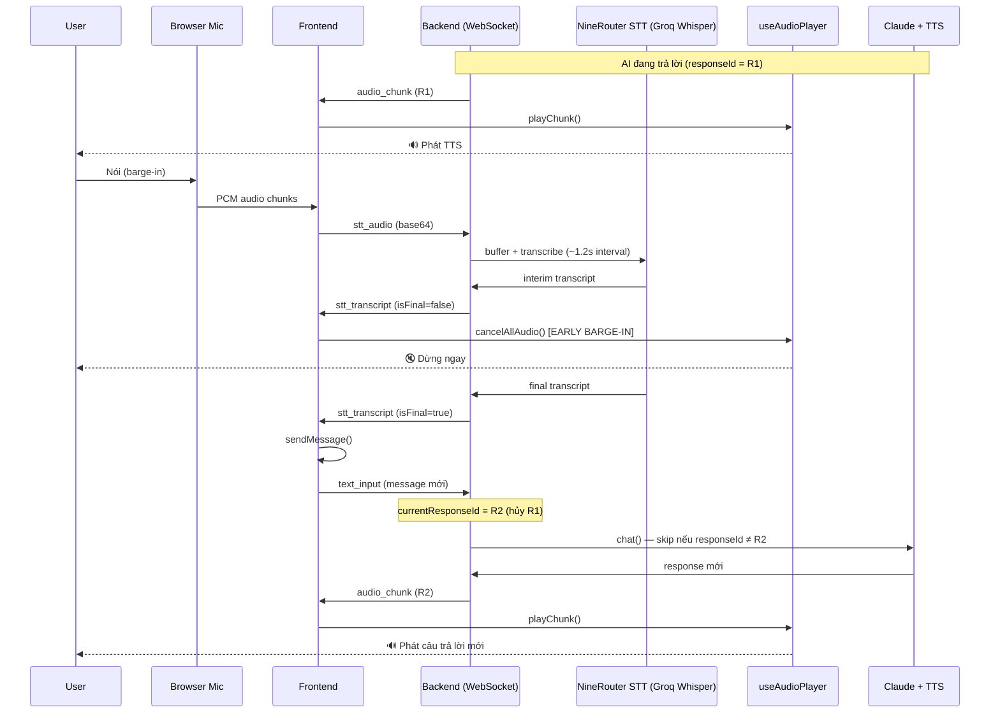
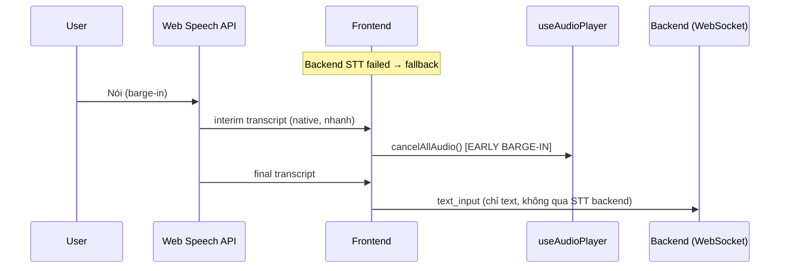

# Barge-in (Cut-in / 割り込み) — Tài liệu tính năng

> **Barge-in** (còn gọi là *cut-in*, *voice interrupt*, hoặc tiếng Nhật *バージイン*) cho phép người dùng **ngắt lời AI đang nói** và đặt câu hỏi mới ngay lập tức — giống cách nói chuyện tự nhiên với con người.

---

## 1. Tổng quan

Trong hệ thống Rabbit AI Avatar, barge-in hoạt động theo mô hình **full-duplex giả lập**:

| Thành phần | Vai trò trong barge-in |
|------------|------------------------|
| **STT layer** (xem §1.1) | Phát hiện giọng nói người dùng (interim + final transcript) |
| **useAudioPlayer** (frontend) | Dừng TTS đang phát, xóa queue audio, từ chối audio cũ |
| **useWaitingPhrase** (frontend) | Dừng âm thanh chờ (short waiting) khi user ngắt lời |
| **WebSocket handler** (backend) | Hủy response cũ qua `responseId`, bỏ qua TTS chunk đang stream |

### 1.1 STT thực tế — KHÔNG phải Google STT ⚠️

Hook frontend tên `useGoogleSTT` là **tên legacy/sai** — codebase **không dùng Google Cloud STT** trong luồng chính.

| Mode | Khi nào active | Cách hoạt động |
|------|----------------|----------------|
| **Primary: NineRouter STT** | Backend STT khởi động thành công | Mic → WebSocket `stt_audio` → Backend buffer PCM → Groq Whisper (qua 9Router hoặc trực tiếp) → `stt_transcript` |
| **Fallback: Web Speech API** | Backend trả `stt_error` (thiếu credential, API key sai…) | Browser native `webkitSpeechRecognition` — **không qua backend** |

```
┌─────────────────────────────────────────────────────────────┐
│  Frontend (useGoogleSTT — tên hook, không phải Google STT)  │
│                                                             │
│  [Primary]  Mic → stt_start/stt_audio → Backend             │
│                    ↓                                        │
│             NineRouter STT (Groq Whisper)                   │
│                    ↓                                        │
│             stt_transcript (interim/final)                  │
│                                                             │
│  [Fallback] stt_error (credential) → Web Speech API         │
│             Browser native, interim ngay lập tức            │
└─────────────────────────────────────────────────────────────┘
```

**Cách kiểm tra mode đang chạy** (browser console):

| Log | Mode |
|-----|------|
| `✅ Google STT started successfully` + backend `9Router STT session started` | Primary (NineRouter) |
| `Backend STT unavailable (...) — falling back to Web Speech API` | Fallback (Browser native) |
| `🎤 Web Speech Recognition started` | Fallback đang active |

> `backend/src/services/google-stt.ts` tồn tại nhưng **không được wire** vào WebSocket handler — là dead code.

**Trải nghiệm người dùng:**

1. AI đang trả lời bằng giọng nói (status: `speaking`)
2. Người dùng bật mic và nói (mic **không cần tắt** — luôn bật trong cuộc hội thoại liên tục)
3. Hệ thống **dừng audio ngay lập tức** (early barge-in ~300–500ms nhanh hơn)
4. Transcript được gửi lên backend → tạo response mới

UI gợi ý: placeholder `"Speaking... (talk to interrupt)"` khi AI đang nói.

---

## 2. Luồng hoạt động

### 2.1 Sơ đồ tổng thể

#### Path A — Primary: NineRouter STT (backend)



#### Path B — Fallback: Web Speech API (browser native)

Kích hoạt khi backend STT lỗi credential (`stt_error`). **Không stream audio lên backend** — nhận diện hoàn toàn trên browser.



> **Khác biệt quan trọng cho barge-in:** Web Speech interim **nhanh hơn** (~100–300ms). NineRouter STT buffered có interval mặc định `NINEROUTER_STT_INTERVAL_MS=1200` → early barge-in **chậm hơn** trên path primary.

### 2.2 Hai giai đoạn phát hiện (Frontend)

| Giai đoạn | Trigger | Ngưỡng mặc định | Mục đích |
|-----------|---------|-----------------|----------|
| **Early Barge-in** | Interim transcript (chưa final) | `NEXT_PUBLIC_EARLY_BARGE_IN_MIN_CHARS=2` | Dừng audio **sớm nhất** (~300–500ms), không chờ STT final |
| **Regular Barge-in** | Final transcript | `NEXT_PUBLIC_BARGE_IN_MIN_CHARS=5` | Gửi message mới lên backend; bỏ qua transcript quá ngắn (noise) |

**Logic trong `page.tsx`:**

```typescript
// Early: dừng audio khi phát hiện ≥2 ký tự interim
if (!isFinal && trimmedText.length >= EARLY_BARGE_IN_MIN_CHARS) {
  if (audioPlayer.isPlaying || wsStatus === "speaking") {
    audioPlayer.cancelAllAudio();
    earlyBargeInTriggeredRef.current = true;
  }
}

// Final: gửi message nếu ≥5 ký tự
if (isFinal && trimmedText.length >= BARGE_IN_MIN_CHARS) {
  sendMessage(trimmedText);
}
```

### 2.3 Hủy response phía Backend

Mỗi request tạo `responseId` duy nhất (`${sessionId}-${timestamp}`). Khi user gửi message mới:

1. `session.currentResponseId` được ghi đè → response cũ bị **coi là cancelled**
2. Mọi callback streaming (LLM delta, TTS chunk, DB search) kiểm tra:
   ```typescript
   if (session.currentResponseId !== responseId) return; // skip
   ```
3. Trước khi gửi kết quả cuối, backend kiểm tra lại — nếu đã cancelled thì **không gửi** text/audio

---

## 3. Chi tiết kỹ thuật

### 3.1 `cancelAllAudio()` — Frontend

Hook `useAudioPlayer` thực hiện:

- Dừng `AudioBufferSourceNode` đang phát
- Xóa toàn bộ audio queue (chunked TTS)
- Xóa protected audio queue
- Đặt `acceptedResponseIdRef = "__CANCELLED__"` → **từ chối mọi audio** đến sau cho đến khi có `responseId` mới

### 3.2 `responseId` — Đồng bộ Frontend ↔ Backend

| Trạng thái | Hành vi |
|------------|---------|
| Audio có `responseId` khớp | Phát bình thường |
| Audio có `responseId` không khớp | Bỏ qua (response cũ) |
| `__CANCELLED__` + audio không có responseId | Bỏ qua |
| `__CANCELLED__` + chunk 0 có responseId mới | Chấp nhận response mới |

### 3.3 Waiting phrase & barge-in

- **Short waiting** (`/waiting-short/*.mp3`): phát khi backend phản hồi > 1s (chỉ với query movie/gourmet)
- Khi barge-in: `stopWaitingPhrase()` được gọi trong `sendMessage()` — dừng timer và audio chờ
- Short waiting được thiết kế **protected** (không bị ngắt giữa chừng trong flow bình thường), nhưng **bị ngắt khi user chủ động barge-in**

### 3.4 Mic luôn bật (Continuous conversation)

- Mic **không tự tắt** sau khi user nói xong
- User chỉ tắt mic khi click nút mic
- Cho phép barge-in liên tục mà không cần bật lại mic

---

## 4. Cấu hình

### 4.1 Barge-in (frontend)

Thêm vào `frontend/.env.local`:

```env
# Số ký tự tối thiểu để GỬI message (final transcript)
# Tránh gửi noise / ký tự đơn lẻ
NEXT_PUBLIC_BARGE_IN_MIN_CHARS=5

# Số ký tự tối thiểu để DỪNG audio sớm (interim transcript)
# Thấp hơn = phản hồi nhanh hơn, nhưng dễ false positive
NEXT_PUBLIC_EARLY_BARGE_IN_MIN_CHARS=2
```

### Bảng khuyến nghị theo ngôn ngữ

| Ngôn ngữ STT | `EARLY_BARGE_IN_MIN_CHARS` | `BARGE_IN_MIN_CHARS` | Ghi chú |
|--------------|---------------------------|---------------------|---------|
| Tiếng Nhật (ja-JP) | 2 | 5 | 2 ký tự hiragana ≈ 1 âm tiết |
| Tiếng Anh (en-US) | 3 | 8 | Tránh trigger bởi "ok", "hi" |
| Môi trường ồn | 3–4 | 8–10 | Giảm false positive |
| Demo / UX ưu tiên tốc độ | 1–2 | 3–4 | Chấp nhận nhiễu cao hơn |

> **Lưu ý:** Hiện tại `page.tsx` cấu hình STT là `en-US`. Nếu chuyển sang `ja-JP`, nên điều chỉnh ngưỡng tương ứng.

### 4.2 STT backend (NineRouter — primary path)

Trong `backend/.env`:

```env
# STT qua 9Router (Groq Whisper)
NINEROUTER_STT_MODEL=groq/whisper-large-v3-turbo
NINEROUTER_STT_INTERVAL_MS=1200   # Interval gửi buffer → ảnh hưởng tốc độ interim barge-in

# Hoặc bypass 9Router, gọi Groq trực tiếp
GROQ_API_KEY=gsk_...              # Phải bắt đầu bằng gsk_, không phải org_
```

Nếu thiếu/sai credential → frontend **tự động fallback** sang Web Speech API.

---

## 5. File liên quan

| File | Vai trò |
|------|---------|
| `frontend/src/app/page.tsx` | Early + regular barge-in, gọi `sendMessage()` |
| `frontend/src/hooks/useAudioPlayer.ts` | `cancelAllAudio()`, quản lý responseId |
| `frontend/src/hooks/useWaitingPhrase.ts` | `stopWaitingPhrase()` khi barge-in |
| `frontend/src/hooks/useGoogleSTT.ts` | **Tên legacy** — orchestrate STT: backend stream + Web Speech fallback |
| `frontend/src/hooks/useWebSpeechFallback.ts` | Browser native STT (fallback path) |
| `frontend/src/components/ChatInput.tsx` | UI placeholder "talk to interrupt" |
| `backend/src/websocket/handler.ts` | `stt_start`/`stt_audio`, `currentResponseId`, hủy response cũ |
| `backend/src/services/ninerouter/stt.ts` | NineRouter STT session (primary backend STT) |
| `backend/src/services/google-stt.ts` | ⚠️ Dead code — không được dùng |
| `shared/types/index.ts` | `responseId`, `isProtected` trong protocol |

---

## 6. Đánh giá

### 6.1 Ưu điểm ✅

| # | Ưu điểm | Chi tiết |
|---|---------|----------|
| 1 | **Phản hồi nhanh (Early barge-in)** | Dùng interim transcript để dừng audio trước khi STT final — cải thiện ~300–500ms so với chỉ dùng final |
| 2 | **Hủy end-to-end** | Frontend dừng audio + Backend hủy LLM/TTS streaming qua `responseId` — tránh "ghost audio" (audio cũ vẫn phát sau khi ngắt) |
| 3 | **Chống noise cơ bản** | Ngưỡng `BARGE_IN_MIN_CHARS` lọc transcript quá ngắn, giảm gửi nhầm lên backend |
| 4 | **Hội thoại liên tục** | Mic luôn bật — UX tự nhiên, không cần bật/tắt mic mỗi lượt |
| 5 | **Tích hợp waiting phrase** | Barge-in cũng dừng âm thanh chờ, tránh chồng chéo audio |
| 6 | **Chunked TTS an toàn** | Queue audio + responseId tracking xử lý parallel TTS streaming đúng cách |
| 7 | **Cấu hình linh hoạt** | Env vars cho phép tune theo môi trường (demo vs production) |

### 6.2 Nhược điểm ⚠️

| # | Nhược điểm | Mức độ | Chi tiết |
|---|------------|--------|----------|
| 1 | **Echo / self-barge-in** | Cao | Mic có thể thu âm TTS từ loa → STT nhận diện nhầm là user nói → trigger barge-in không mong muốn. Chưa có AEC (Acoustic Echo Cancellation) dedicated |
| 2 | **False positive early barge-in** | Trung bình | Ngưỡng 2 ký tự interim dễ kích hoạt bởi noise, tiếng thở, hoặc echo |
| 3 | **Không có backend abort cho LLM** | Trung bình | Backend skip *delivery* nhưng Claude API call có thể vẫn chạy đến hết → lãng phí token/latency |
| 4 | **Protected audio không nhất quán** | Thấp | Short waiting "protected" nhưng vẫn bị barge-in override; long_waiting backend có `isProtected: true` nhưng đang disabled |
| 5 | **Không phân biệt ý định ngắt** | Trung bình | Mọi speech đều trigger barge-in — không phân biệt "ừ", "wait" vs câu hỏi thực sự |
| 6 | **Ngưỡng theo ký tự, không theo thời gian** | Thấp | Không có VAD-based barge-in (chỉ dựa vào STT transcript length) |
| 7 | **STT language mismatch tiềm ẩn** | Thấp | Config hiện tại `en-US` trong khi app hướng tới tiếng Nhật — ảnh hưởng độ chính xác barge-in |
| 8 | **Không có visual feedback riêng** | Thấp | Chỉ có placeholder text; không có indicator "đang ngắt lời AI" |
| 9 | **Race condition TTS in-flight** | Thấp | TTS chunk đã synthesize xong trước khi cancel vẫn tốn resource backend dù frontend reject |
| 10 | **Tên hook gây hiểu nhầm** | Thấp | `useGoogleSTT` không dùng Google STT — dễ nhầm khi đọc doc/code |
| 11 | **NineRouter STT buffered, không streaming thật** | Trung bình | Interim transcript mỗi ~1.2s → early barge-in **chậm hơn** Web Speech native (~100–300ms) |
| 12 | **Hai STT path khác hành vi** | Trung bình | Dev dùng fallback (Web Speech) vs prod dùng NineRouter → barge-in latency khác nhau, khó reproduce bug |

---

## 7. Đề xuất cải thiện

### 7.1 Ưu tiên cao 🔴

#### A. Acoustic Echo Cancellation (AEC)

**Vấn đề:** Echo từ loa → mic → STT → false barge-in.

**Đề xuất:**
- Bật `echoCancellation: true`, `noiseSuppression: true` trong `getUserMedia` constraints
- Cân nhắc WebRTC AEC hoặc giảm volume TTS khi mic đang listen
- Thêm **cooldown period** (~500ms) sau khi TTS bắt đầu trước khi cho phép early barge-in

```typescript
// Ví dụ: cooldown sau khi audio bắt đầu
const BARGE_IN_COOLDOWN_MS = 500;
const ttsStartTimeRef = useRef(0);

// Trong early barge-in check:
if (Date.now() - ttsStartTimeRef.current < BARGE_IN_COOLDOWN_MS) return;
```

#### B. AbortController cho LLM streaming

**Vấn đề:** Response cũ vẫn tiêu tốn token dù đã cancelled.

**Đề xuất:**
- Truyền `AbortSignal` vào Claude API call
- Khi `currentResponseId` thay đổi → `abortController.abort()`
- Tiết kiệm cost và giảm tải backend

#### C. VAD-based pre-detection

**Vấn đề:** NineRouter STT buffered (~1.2s interval) → interim chậm; chỉ dựa transcript không đủ cho early barge-in nhanh.

**Đề xuất:**
- Dùng energy level / WebRTC VAD để **mute TTS sớm hơn** trước khi STT có kết quả
- Kết hợp: VAD trigger → duck volume TTS → STT confirm → full cancel
- Giảm `NINEROUTER_STT_INTERVAL_MS` (trade-off: tăng API calls/cost)

#### C2. Rename hook + làm rõ STT mode trong UI

**Vấn đề:** `useGoogleSTT` gây hiểu nhầm; user/dev không biết đang ở path nào.

**Đề xuất:**
- Rename `useGoogleSTT` → `useSpeechToText` hoặc `useStreamingSTT`
- Hiển thị badge debug: `STT: NineRouter` / `STT: Web Speech (fallback)`

### 7.2 Ưu tiên trung bình 🟡

#### D. Intent-aware barge-in

Phân loại transcript trước khi gửi backend:

| Pattern | Hành vi |
|---------|---------|
| Filler words ("ừ", "ああ", "um") | Chỉ duck volume, không gửi backend |
| "待って", "stop", "wait" | Dừng audio, không gửi backend |
| Câu hỏi thực sự (≥ N ký tự + không match filler) | Full barge-in + gửi backend |

#### E. Adaptive thresholds

Thay vì ngưỡng cố định, điều chỉnh động:

- Tăng ngưỡng khi phát hiện môi trường ồn (SNR thấp)
- Giảm ngưỡng khi user đang trong "speaking" state lâu (user có thể muốn ngắt sớm)
- Log metrics: false positive rate, barge-in latency → auto-tune

#### F. Visual & haptic feedback

- Icon/micro-animation khi barge-in active (mic pulse đổi màu)
- Toast nhẹ: "Đã ngắt lời AI"
- Cải thiện accessibility

#### G. Backend notification explicit

Thêm message type `barge_in` từ frontend → backend:

```typescript
{ type: "barge_in", previousResponseId: "..." }
```

Backend có thể cleanup TTS queue, abort LLM ngay lập tức thay vì chỉ rely on responseId check ở callback.

### 7.3 Ưu tiên thấp 🟢

#### H. Barge-in analytics dashboard

Track metrics:
- `barge_in_latency_ms` (speech start → audio stop)
- `false_positive_count` (barge-in rồi user im lặng)
- `cancelled_response_token_waste`

#### I. Headphone mode detection

- Phát hiện output device (headphone vs speaker)
- Tự động điều chỉnh ngưỡng: headphone → ngưỡng thấp hơn (ít echo), speaker → ngưỡng cao hơn

#### J. Graceful partial response

Khi barge-in, lưu phần response AI đã nói vào history (optional) thay vì discard hoàn toàn — hữu ích cho context dài.

---

## 8. Test plan

### Manual test

| # | Scenario | Expected |
|---|----------|----------|
| 1 | AI đang nói → user nói câu dài | Audio dừng trong <500ms, response mới được tạo |
| 2 | AI đang nói → user im lặng | Không trigger barge-in |
| 3 | AI đang nói → noise ngắn (<2 ký tự) | Không dừng audio |
| 4 | Barge-in liên tiếp 3 lần | Không ghost audio, không memory leak |
| 5 | Barge-in khi short waiting đang phát | Waiting dừng, response mới phát bình thường |
| 6 | Barge-in khi backend đang search DB | Response cũ cancelled, search mới chạy |

### Debug logs

**Xác định STT path trước:**

| Browser console | Backend log |
|-----------------|-------------|
| `Backend STT unavailable — falling back to Web Speech API` | — |
| `🎤 Web Speech Recognition started` | — (không có STT session) |
| `✅ Google STT started successfully` | `🎙️ 9Router STT session started` |

**Barge-in logs (browser):**

```
🟡 EARLY BARGE-IN: Stopping audio (N chars detected)
🔇 REGULAR BARGE-IN: Stopping audio
⏭️ Transcript too short (N chars), ignoring
CANCEL ALL: Stopping audio and rejecting future audio
```

**Backend logs:**

```
Cancelling previous response (barge-in)
Response cancelled, skipping delivery
```

---

## 9. Tóm tắt

Barge-in là tính năng **core UX** của Rabbit AI Avatar, cho phép hội thoại giọng nói tự nhiên. Kiến trúc hiện tại **mạnh ở frontend** (early detection + audio cancellation) và **đủ ổn ở backend** (responseId-based skip), nhưng cần cải thiện **echo handling**, **LLM abort**, và **intent detection** để đạt chất lượng production.

| Khía cạnh | Đánh giá |
|-----------|----------|
| Tốc độ phản hồi | ⭐⭐⭐⭐ (early barge-in hiệu quả) |
| Độ tin cậy | ⭐⭐⭐ (echo/false positive là rủi ro chính) |
| Kiến trúc | ⭐⭐⭐⭐ (responseId pattern rõ ràng) |
| Cost efficiency | ⭐⭐ (LLM không abort) |
| UX | ⭐⭐⭐⭐ (continuous mic, placeholder hint) |

---

*Tài liệu được tạo dựa trên codebase tại commit hiện tại. Tham khảo thêm: [README.md](./README.md), [shared/PROTOCOL.md](./shared/PROTOCOL.md).*
